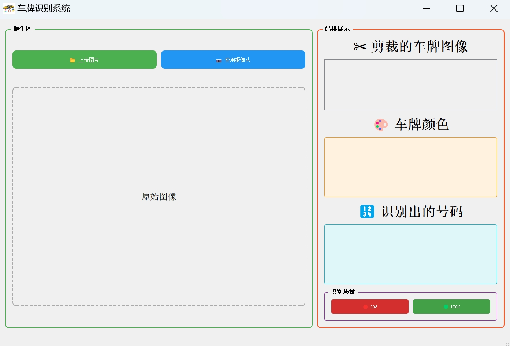
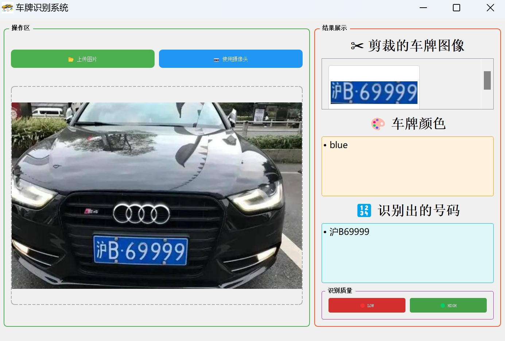

# 基于OpenCV和LPRNet的车牌识别系统

- [基于OpenCV和LPRNet的车牌识别系统](#基于opencv和lprnet的车牌识别系统)
  - [简介](#简介)
  - [总体流程](#总体流程)
  - [具体实现](#具体实现)
  - [文件目录](#文件目录)
  - [使用教程](#使用教程)
  - [**Wish for your Star⭐!**](#wish-for-your-star)

## 简介

本仓库为 上海交通大学 **视频多媒体检索实践(ICE2607)** 课程大作业，基于**OpenCV**和**LPRNet**搭建一个车牌识别系统，主要实现以下功能：

- 检测到图像中是否存在车牌；
- 定位车牌在图像中的位置，输出裁切后的车牌图像及颜色；
- 分割车牌字符，并与字符库匹配、检索并输出结果；
- 设计车牌识别系统的 GUI 界面；
- 生成 exe 文件，供用户运行，并且支持从本地文件中上传或者由摄像头拍摄图像。

**小组成员：** **DZX GJY WH XKY YN**

## 总体流程

1. 利用传统的 **OpenCV** 方法检测车牌并裁剪出来；
2. 将裁减好的车牌二值化，根据横向波峰分布分割字符；
3. 搭建**LPRNet**卷积神经网络；
4. 根据用户需求以及内部函数的接口设计**GUI界面**；
5. 设计**LOGO**，将所有代码封装，统一打包成exe文件并发行。

## 具体实现

详见 [基于OpenCV和LPRNet的车牌识别系统.pdf](https://github.com/PasserbyZzz/PlateRecognition/blob/main/Report/%E5%9F%BA%E4%BA%8EOpenCV%E5%92%8CLPRNet%E7%9A%84%E8%BD%A6%E7%89%8C%E8%AF%86%E5%88%AB%E7%B3%BB%E7%BB%9F.pdf)

## 文件目录

- **PlateRecognition**
    - **bin**：可供用户直接运行的exe文件
    - **GUI**
      - **`GUI-PyQt5.py`**：GUI界面代码
    - **Icon**：LOGO等图标
    - **imgs**：供README.md使用的图片
    - **Location**
      - **dataset**：测试用数据集
      - **`locatation.py`**：车牌定位、裁剪、字符分割代码
    - **Recognition**
      - **`recognition.py`**：字符识别代码
    - **TrainModel**
      - **`load_data.py`**：数据预处理加载代码
      - **`LPRNet.py`**：模型构建代码
      - **`train_LPRNet.py`**：模型训练代码
    - **Report**：具体报告

## 使用教程

打开exe文件后，用户界面如下图所示。

- **📂 上传图片**：从本地选取图像
- **📷 使用摄像头**：通过电脑摄像头拍照获得图像

上传图像后，用户界面如下所示。

- **✂️ 剪裁的车牌图像**：裁剪出的车牌
- **🎨 车牌颜色**：车牌颜色
- **🔢 识别出的号码**：车牌字符

***注意：*** 
- 若发现车牌裁剪不完全，即除了车牌还有其他不相干的东西，可点击**`LOW`**按钮重新进行裁剪；
- 若发现车牌裁剪过多，即裁剪后只剩下部分车牌，可点击**`HIGH`**按钮重新进行裁剪。

## **Wish for your Star⭐!**